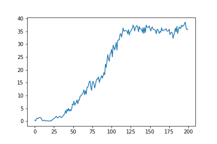

# Continuous Control Project -- Reacher

## Background

For this Udacity project, we are tasked with training an autonomous agent that controls double-jointed robotic arms with a goal of placing and keeping the agent's hand in the correct location. The environment is a custom Unity game developed jointly by Unity and Udacity for the Deep Reinforcement Learning nanodegree called Reacher.

The environment was solved in 180 episodes using a DDPG algorithm.

|  |
| --- |
| *Training results* |

## Software Requirements
A conda environment yaml file is provided, but is not guaranteed to work. Installation instructions are provided below.

This project was completed on MacOS Big Sur, v11.5, with `python==3.6.12`, `unityagents==0.4.0`, and `torch==0.4.0`.

There are two versions of the environment. Version 1 includes one agent. Version 2 includes Twenty Agents. Download the Unity environment for your proper OS:

**Version 1: One Agent**
- [Linux](https://s3-us-west-1.amazonaws.com/udacity-drlnd/P2/Reacher/one_agent/Reacher_Linux.zip)
- [MacOS](https://s3-us-west-1.amazonaws.com/udacity-drlnd/P2/Reacher/one_agent/Reacher.app.zip)
- [Windows](https://s3-us-west-1.amazonaws.com/udacity-drlnd/P2/Reacher/one_agent/Reacher_Windows_x86_64.zip)

**Version 2: Twenty Agents**
- [Linux](https://s3-us-west-1.amazonaws.com/udacity-drlnd/P2/Reacher/Reacher_Linux.zip)
- [MacOS](https://s3-us-west-1.amazonaws.com/udacity-drlnd/P2/Reacher/Reacher.app.zip)
- [Windows](https://s3-us-west-1.amazonaws.com/udacity-drlnd/P2/Reacher/Reacher_Windows_x86_64.zip)

## The Environment

|  |
| --- |
| *The Reacher environment captured by the Udacity team.* |

**TODO** The Reacher environment is a custom Unity game developed by the Unity and Udacity teams. It is a standalone application that can be run on all major operating systems.

The rewards in this environment are +0.1 for every step that the robotic arm is within the target area. At the end of the robotic arm is a small blue node. The target is a large, blue, semi-translucent sphere that rotates around the arm.

There are 20 agents in this environment. Each agent's states are 33 dimensions corresponding to the position, rotation, velocity, and angular velocities of the arm.

The environment uses an action space of 4, corresponding to the torque of the two arm joints. These torques must be between [-1, 1].

The environment is considered solved when an agent obtains an average score of +30 over 100 runs.

## Installation
The README has instructions for installing dependencies or downloading needed files.

First, please download the appropriate Reacher environment from the links above.

Second, build your environment. I would first try to install the conda environment using the included `environment.yml` file although I expect it will fail. If so, follow the next instructions.

### Dependencies

1. Create an environment using Python 3.6:

  - __Linux__ or __Mac__:
  ```
  conda create --name drlnd python=3.6
  source activate drlnd
  ```

2. (Optional but recommended) Install OpenAI Gym

  - `pip install gym`


3. Install unityagents

  - `pip install unityagents==0.4.0`


4. Install PyTorch 0.4.0

  - `pip install torch==0.4.0.`


5. Install Jupyter

  - `conda install -c conda-forge notebook`


6. Create an IPython kernel for use with your Jupyter notebook

  - `python -m ipykernel install --user --name drlnd --display-name "drlnd"`
  - This step will allow you to use your conda environment as your kernel in Jupyter

## How to Use


There are 4 main files within this effort: `Reacher.app`, `Continuous_Control.ipynb`, `ddpg_agent.py`, and `model.py`.

- `Reacher.app` is the Unity environment file and will be named differently for Linux or Windows environments
- `Continuous_Control.ipynb` is the notebook where your code will be executed from
- `ddpg_agent.py` is the file that contains the function for the DDPG algorithm. This function calls the model defined in `model.py`. It also contains the hyperparameters that can be set, including:
  - __BUFFER_SIZE__: replay buffer size
  - __BATCH_SIZE__: minibatch size
  - __GAMMA__: discount factor
  - __TAU__: soft update of target parameters
  - __LR_ACTOR__: learning rate of the actor network
  - __LR_CRITIC__: learning rate of the critic network
  - __WEIGHT_DECAY__: L2 regularization
  - __UPDATE_EVERY__ : how often network updates
- `model.py` defines the model architecture

### Training the model

1. Define your model architecure in `model.py`, ensuring your inputs are equal to the state size, and your outputs are equal to the action space.

2. Update hyperparameters in `ddpg_agent.py`. The hyperparameters provide a good starting point and solve the environment relatively quickly.

3. Navigate to the `Continuous_Control.ipynb`.

4. In Section 4, you can update some training parameters, including `n_episodes` (the number of training episodes) and `max_t`, the max number of steps per episode.

5. Line 29 and 30, `torch.save(..., 'checkpoint.pth')`, saves the actor and critic model weights every episode.

## Credits

The Reacher environment, the GIF used above, and the template for the DDPG code was from the Udacity team.
